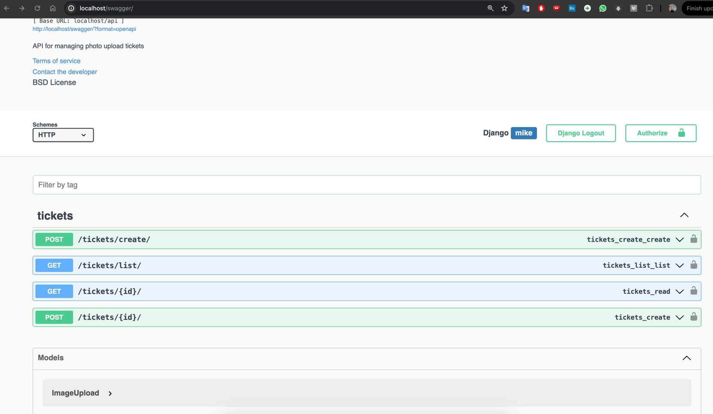
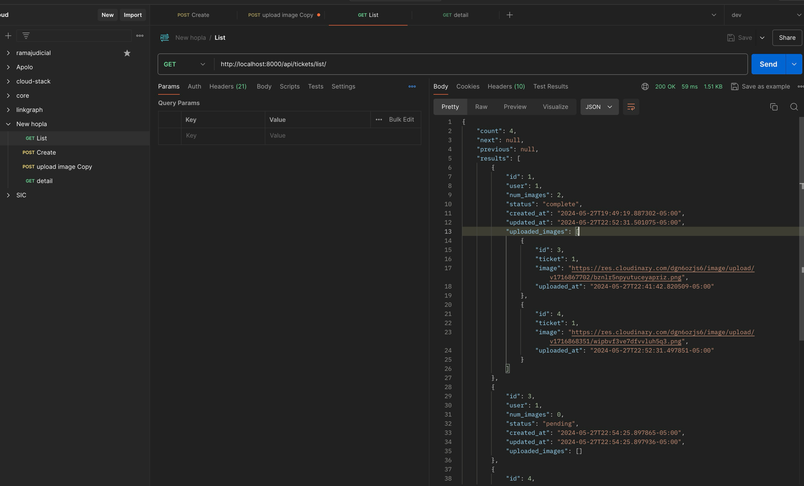
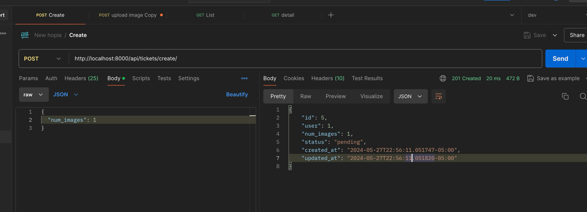
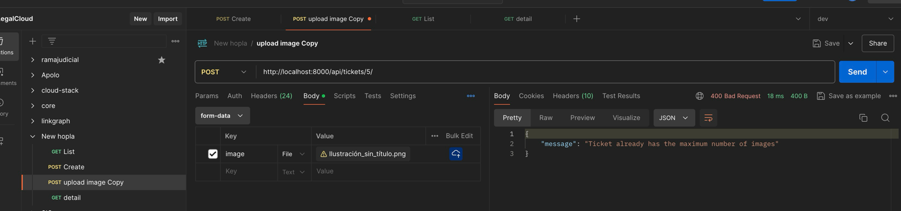

# Mike Brian Olivera

## Description

This project use[ this file as requirements](documentation/Prueba%20Backend%20Developer%20-%20Hopla%20Software.pdf)

## Testing

- http://localhost:8000/swagger/
- Postman Collection: [Hopla.postman_collection.json](documentation/api/Hopla.postman_collection.json)

## Run Project

```bash
make deploy
```

create a superuser

```bash
make superuser
```


# Screenshots
## Swagger


## Api
  
### List


### create


### upload image

